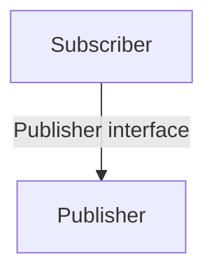
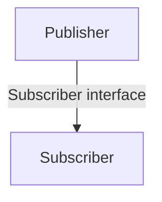
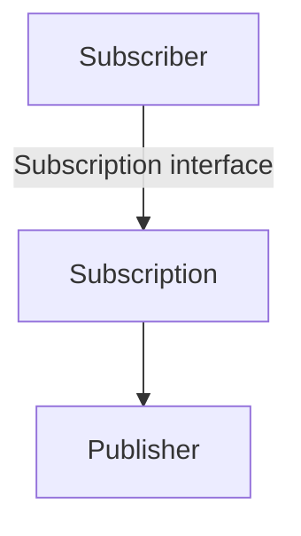
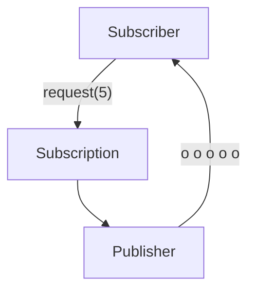
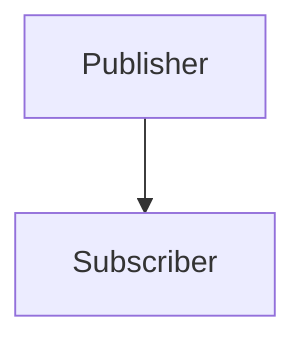
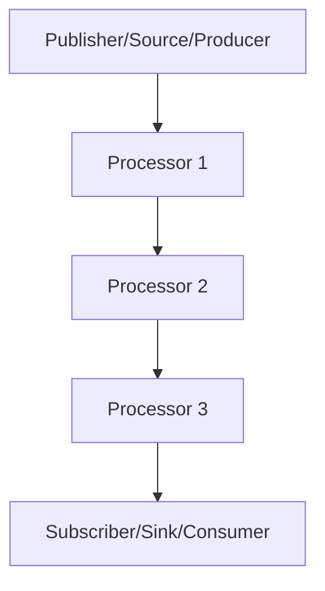

# Reactive Programming

Reactive programming is a programming paradigm design to process streams of messages in a non-blocking and asynchronous
manner, while handling backpressure. Reactive programming handle IO operations more efficiently.

It is based on observer design pattern.

https://www.reactive-streams.org/

Reactive Streams is an initiative to provide a standard for asynchronous stream processing with non-blocking back
pressure. This encompasses efforts aimed at runtime environments (JVM and JavaScript) as well as network protocols.

## Benefits of Reactive Programming

* Handles many concurrent requests with fewer threads
* Non-blocking I/O → better scalability for I/O-bound systems
* Efficient with slow or unpredictable external services
* Supports streaming data (real-time updates, events)
* Built-in backpressure to avoid overloading consumers
* Better resource utilization (CPU, memory, threads)
* Easier to add timeouts, retries, fallbacks
* Declarative and composable async pipelines
* Well suited for cloud, microservices, and Kubernetes

## Reactive Manifesto

* Responsive - ability to react/respond in a timely manner
* Resilient - stay responsive in the face of failures
* Elastic - stay responsive under varying workloads
* Message Driven - rely on asynchronous message-passing

## Reactive streams implementations

* RxJava2
* Akka streams
* Reactor

## Publisher/Subscriber

### Subscriber connects



```java
public interface Publisher<T> {
    void subscribe(Subsciber<? super T> s);
}
```

### Publisher calls onSubscribe



```java
public interface Subscriber<T> {
    void onSubscribe(Subscription s);

    void onNext(T t);

    void onError(Throwable t);

    void onComplete();
}
```

### Subscription



```java
public interface Subscription {
    void request(long n);

    void cancel();
}
```

### Publisher pushes data via onNext



### Publisher doesn't have more items onComplete



## Publisher/Subscriber/Processor


